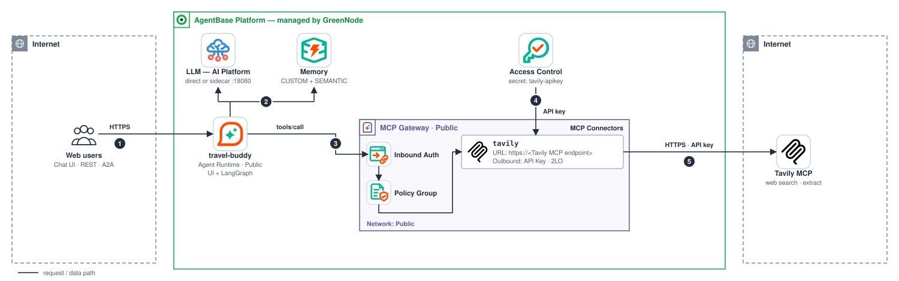
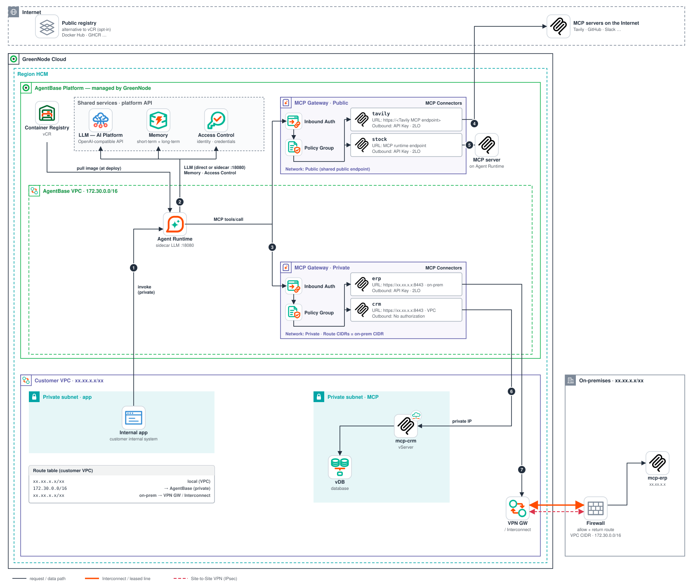

# Travel Buddy — A Travel Assistant with Memory

[](https://github.com/GreenNode-Samples/sample-travel-buddy/actions/workflows/ci.yml)
[](LICENSE)

> An **end-to-end** sample on **GreenNode AgentBase**: Agent Runtime (LangGraph) + **Memory** (2 strategies) + **MCP Governance** (MCP Gateway + Policy Group) + **LLM AIP**. Runs locally out of the box **and** deploys straight to your own AgentBase account.

[Interactive architecture diagram](docs/architecture.html) · The Vietnamese-language guide is available in the repo history.

## Live demo (public endpoints)

| What | URL |
|---|---|
| **Chat UI** (open in browser) | https://endpoint-5bd80bd4-183e-4157-a004-9df9b1d24cd1.agentbase-runtime.aiplatform.vngcloud.vn/ |
| REST API | https://endpoint-5bd80bd4-183e-4157-a004-9df9b1d24cd1.agentbase-runtime.aiplatform.vngcloud.vn/invocations |
| Health | https://endpoint-5bd80bd4-183e-4157-a004-9df9b1d24cd1.agentbase-runtime.aiplatform.vngcloud.vn/health |

> Endpoint lives on the demo account — it may be taken down after the demo period; deploy your own with Step 5 below.

---

## The experience — the agent *remembers* you

| You say (user `alice`, session 1) | What the agent does (automatically) |
|---|---|
| "I love the beach, I'm vegetarian, budget ~5M VND, going to Da Nang in June" | Tavily search through the **MCP Gateway** → itinerary + weather • `remember` → stores your preferences • the Memory engine auto-extracts records (CUSTOM + SEMANTIC) |
| Return in a **different session** (days later): "Where should I go next?" | The UI shows an "**Agent just recalled**" callout • the reply matches your earlier preferences — **no need to repeat yourself** |

The 3-column dark UI: **Users/Sessions** · **Chat** (markdown + memory callout, **token-by-token streaming**) · **Memory** (records grouped per strategy, auto-refresh).

## Architecture



> MCP flow: **Agent → MCP Gateway (Inbound Auth) → Policy Group → MCP Connector (Outbound Auth) → MCP server**. LLM calls are a **separate path** (direct to LLM AIP here; on AgentBase Runtime they can also go through the *Sidecar LLM Proxy* — see [LLM endpoint](#llm-endpoint-optional-sidecar-llm-proxy)).

- **Runtime** — `src/backend`: the `GreenNodeAgentBaseApp` SDK, agent = langchain `create_agent` + middleware (see [Agent loop](#agent-loop)) + MCP tools + 2 memory tools; the `X-GreenNode-AgentBase-User-Id` (→ memory `actorId`) / `-Session-Id` (→ `thread_id`) headers partition memory per user. **Both are required on every memory path** — missing → `400` (no default user/session, to avoid mixing data between users).
- **Memory** — one memory, 2 long-term strategies: `user-preferences` (**CUSTOM**, dedicated extraction prompt) + `trip-facts` (**SEMANTIC**). Checkpointer `AgentBaseMemoryEvents` stores conversations; namespace `/strategies/<id>/actors/<userId>`. The `recall` tool searches **both** strategies (top 5 each, minimum score 0.3, merged and de-duplicated); `remember` writes to `user-preferences`.
- **MCP Gateway** (module **MCP Governance**) — `sample-mcp-gw`, **Inbound Auth = IAM Permissions** (alternatives: JWT (default) / No authorization), `tavily` **MCP Connector** (endpoint URL + **Outbound Auth = API Key 2LO**). **Policy Group** `sample-gw-policy` (first match wins): only travel-buddy may call the 5 Tavily actions — a `tools/call` matching no rule gets **403** (verified: unknown token → "Request denied by policy."). Note: with **no** Policy Group attached, *every* `tools/call` is 403; `tools/list` bypasses policy.
- **Frontend** — `src/frontend`: vanilla SPA, served by the backend at `GET /` (same-origin, no CORS).

## Network — Runtime, vCR, MCP Gateway & connectors



- **Agent Runtime** and **MCP Gateway** are managed by GreenNode on the AgentBase Platform — never inside your VPC. In **Public** mode they are reached through AgentBase's **shared public endpoint**; in **Private** mode they run in the **AgentBase VPC** (`172.30.0.0/16`) and connect privately to your VPC (select VPC + Subnet + Route CIDRs). Images are pulled from **Container Registry (vCR)**, or from a public registry if you agree to that.
- **LLM, Memory, Access Control** are GreenNode platform services. The LLM is an OpenAI-compatible endpoint: this sample calls it directly via `LLM_BASE_URL`, and on Agent Runtime you can route it through the Sidecar LLM Proxy instead (see [LLM endpoint](#llm-endpoint-optional-sidecar-llm-proxy)). Memory and Access Control are reached through the SDK using an IAM service account that the runtime injects automatically.
- **MCP Gateway** = Inbound Auth (IAM Permissions / JWT) → Policy Group → **MCP Connector** (URL + Outbound Auth). One gateway holds every connector the agent needs (MCP servers on the Internet, on Agent Runtime, in your VPC and on-premises), so an agent talks to **one** gateway with one endpoint, one Policy Group and one audit trail. Use **Public** mode when every connector has a public endpoint (this demo); switch to **Private** mode as soon as one connector lives in your VPC or on-premises (add Route CIDRs for on-premises). The docs do not say whether a Private gateway can also reach the Internet; see [One gateway per agent](docs/network/README.md#one-gateway-per-agent) for how to keep Internet connectors on the same gateway if it cannot.

Details for each use case (MCP in a cloud VPC, MCP on-premises) and how to connect on-premises to your VPC: **[docs/network/README.md](docs/network/README.md)**.

| | This demo | UC A · MCP in a cloud VPC | UC B · MCP on-premises |
|---|---|---|---|
| Runtime | Public · image on vCR | Private (called by an internal app) | Private (called by an internal app) |
| MCP Gateway (one per agent) | Public | Private | Private + on-premises Route CIDRs |
| Connectors → MCP | `tavily` → Internet | `crm`, `inventory` → vServer / VKS · `tavily` stays on the same gateway | `erp`, `hr` → data center via VPN / Interconnect · `tavily` stays on the same gateway |

## Layout

```
├── src/backend/          # main.py (routes) · agent.py (agent loop) · memory_tools.py · mcp_client.py · requirements.txt
├── src/frontend/         # index.html · style.css · app.js (no build step)
├── tests/                # pytest: fake LLM, fake Memory API, mocked MCP gateway (no network)
├── docs/
│   ├── architecture.html            # interactive diagram (archify)
│   └── network/                     # AWS-style network diagrams (SVG) + README · build_diagrams.py
├── Dockerfile · .env.example
```

## Agent loop

`src/backend/agent.py` builds the agent with langchain 1.x middleware, so a misbehaving model or tool cannot hang or break a turn:

| Concern | How |
|---|---|
| Runaway loops | `ModelCallLimitMiddleware(run_limit=10)` ends the turn with a friendly Vietnamese apology; `ToolCallLimitMiddleware(run_limit=8)` refuses further tool calls with an error the model reads, so it still writes an answer |
| Failing tools | `ToolErrorMiddleware`: an exception in any tool (MCP call, `remember`, `recall`) becomes an error message for the model (exception type only, no trace) instead of killing the turn |
| Transient LLM errors | `ModelRetryMiddleware(max_retries=2)` on connection errors, 429 and 5xx. It is the only retry layer (the OpenAI client runs with `max_retries=0`), so a dead LLM costs at most 3 attempts of 60 s |
| Context size | `SummarizationMiddleware`: above ~16,000 tokens the older messages are replaced by a summary and the last 12 are kept; AI tool calls are never separated from their tool results |
| Current date | a dynamic prompt writes "now" in `Asia/Ho_Chi_Minh` into the system prompt on every model call (the agent object is cached for the life of the process) |
| Tool output size | MCP tool results are capped at 8,000 characters with a `...[truncated N chars]` marker |
| Checkpoint traffic | `durability="exit"`: one checkpoint write per turn instead of one per graph step |
| MCP tools | loaded from the gateway on first use and refreshed every 10 minutes; a failed or empty `tools/list` is retried on the next turn (`/ready` shows recovery); the agent is rebuilt when the tool list changes; one malformed tool schema skips only that tool |

`memories_used` (the "Agent just recalled" callout) lists what `remember` / `recall` returned during the **current** turn only.

## Run locally

Requires **Python 3.12** (or Docker) and the GreenNode resources from Steps 1-3 below (LLM key, Memory, MCP Gateway connector). Outside AgentBase Runtime also set `GREENNODE_CLIENT_ID` / `GREENNODE_CLIENT_SECRET` (a service account that may call Memory and the gateway).

```bash
cp .env.example .env       # fill values — see the Env reference below
```

Without Docker (the backend loads `.env` itself):

```bash
python3.12 -m venv .venv && source .venv/bin/activate
pip install -r src/backend/requirements.txt
python src/backend/main.py
# open http://localhost:8080
```

With Docker:

```bash
docker build -t travel-buddy . && docker run -p 8080:8080 --env-file .env travel-buddy
```

Run the tests (no network or credentials needed): `pip install pytest ruff && pytest -q`.

## Deploy to GreenNode AgentBase — via the Portal (UI)

Portal: **https://aiplatform.console.vngcloud.vn** → *AI Platform / AgentBase*. Menu names may differ slightly per console version; each step also lists the equivalent API.

### Step 1 — LLM API key (LLM AIP / Model Access)
1. Portal → **LLM / Model Access** (or *API Keys*) → **Create API Key** → copy the `lap-…` key.
2. API: `POST /llm/api/v1/api-keys` (see `GET /llm/api/v1/models` to pick a model, e.g. `z-ai/glm-5.3-flash`).
3. The code calls the LLM at `LLM_BASE_URL` (default: LLM AIP). See [LLM endpoint](#llm-endpoint-optional-sidecar-llm-proxy) if you want to use the Sidecar LLM Proxy on the Runtime.

### Step 2 — Create Memory
1. Portal → **Memory** → **Create Memory** → name it `travel-buddy-memory`.
2. Add **2 long-term strategies**:
   - `user-preferences` — type **CUSTOM**, paste this *extraction prompt*: *"Extract the user's travel preferences: style (beach/mountain...), food (vegetarian/spicy/street food), budget, planned destination and dates. One Vietnamese sentence per record."*
   - `trip-facts` — type **SEMANTIC**, auto-generate ON, 30-day expiry.
3. Copy the **Memory ID** (`memory-…`) and both **Strategy IDs** (`ltms-…`).
4. API: `POST /memory/memories` with `longTermMemoryStrategies: [{name, type: "CUSTOM"|"SEMANTIC", customFactExtractionPrompt?, autoGenerate: true, expiryDays: 30}]`.

### Step 3 — Create the MCP Gateway + connector
1. Portal → **MCP Governance → MCP Gateway** (a.k.a. Resource Gateway) → **Create Gateway**: name `sample-mcp-gw`, **Inbound Auth = IAM Permissions**, public endpoint, smallest flavor.
2. Once the gateway is **ACTIVE** → **Add Custom Connector** (the *Connect* button): fill the modal with
   - **Name**: `tavily`
   - **Type**: `MCP`
   - **Endpoint / Connect URL**: `https://mcp.tavily.com/mcp/`
   - **Outbound Auth**: **API Key** (`APIKEY`) → flow **2LO**, create provider `tavily-apikey`, *API key* = your Tavily key (tavily.com), header `Authorization`, prefix `Bearer `
3. Copy the **Gateway URL** (`https://gw-<name>-<id>.agentbase-gateway.…vn`) → the agent's URL is `<gateway>/tavily`.
4. API: `POST /gateway/api/v1/gateways` → `PATCH /gateway/api/v1/gateways/sample-mcp-gw` with `targets:[{name:"tavily",type:"MCP",endpoint:"https://mcp.tavily.com/mcp/",outboundAuth:{type:"APIKEY",flow:"2LO",providerName:"tavily-apikey",headerName:"Authorization",headerValuePrefix:"Bearer "}}]`.

### Step 4 — Policy Group (protect the gateway)
> Evaluation order: Inbound Auth → **Policy Group** (first match wins; no rule matches → 403; no Policy Group attached → all `tools/call` are 403; `tools/list` bypasses policy) → Connector Outbound Auth → MCP server.

1. Deploy the agent first (Step 5) with `DEBUG_OPS=1`, then call `POST /invocations {"op":"whoami"}` on the runtime endpoint (add `-H "X-API-Key: …"` if `AGENT_API_KEY` is set) to get the agent's `token_sub`. Set `DEBUG_OPS` back to `0` afterwards.
2. Portal → **MCP Governance → Policy Group** → **Create Policy Group** `sample-gw-policy` → add a policy:
   - `allow-travel-tavily` — effect **allow** · principal `iam:<runtime-token_sub>` · actions `tavily__tavily_search`, `tavily__tavily_extract`, `tavily__tavily_crawl`, `tavily__tavily_map`, `tavily__tavily_research` · resources `gateway:sample-mcp-gw`
3. Back on the **Gateway**, attach the policy group. From then on any caller no rule allows → 403 *"Request denied by policy."*
4. API: `POST /policy/api/v1/policy-groups` → `POST /policy/api/v1/policy-groups/<gid>/policies` → `PATCH /gateway/api/v1/gateways/sample-mcp-gw {"policyGroupId":"…"}`.

### Step 5 — Deploy the runtime
1. Build & push the image: `docker build -t <registry>/travel-buddy:v1 . && docker push …` (your project's **vCR** registry; `docker login` per the Portal → Container Registry instructions).
2. Portal → **AgentBase / Agents** → **Create Agent (Custom)**: name `travel-buddy`, the image above, flavor `runtime-s2-general-2x4`, and **environment variables** per the table below (**no** `GREENNODE_CLIENT_ID/SECRET` needed — the runtime auto-injects `GREENNODE_CLIENT_ID`, `GREENNODE_CLIENT_SECRET` and `GREENNODE_AGENT_IDENTITY`).
3. **Security Settings** of the runtime: set **IP Access Control** (allowed source CIDRs) and **Inbound Identity** (IAM Permissions / JWT) — see *Production hardening* below.
4. Open the **endpoint URL** → the chat UI appears immediately (`GET /`).
5. CLI alternative: `runtime.sh create --name travel-buddy --image … --flavor runtime-s2-general-2x4 --from-cr --env-file .env.deploy`.
6. **Set `AGENT_API_KEY`** (and Runtime Security Settings) before exposing the endpoint: see [Production hardening](#production-hardening).

## Env reference

| Variable | Required | Meaning |
|---|---|---|
| `LLM_API_KEY` | Yes | LLM AIP key (`lap-…`) |
| `LLM_BASE_URL` | optional | OpenAI-compatible endpoint, default LLM AIP `https://maas-llm-aiplatform-hcm.api.vngcloud.vn/v1`. On AgentBase Runtime may point to the Sidecar LLM Proxy `http://localhost:18080` (verify with GreenNode) |
| `LLM_MODEL` | optional | default `z-ai/glm-5.3-flash` |
| `AGENTBASE_MEMORY_ID` | Yes | `memory-…` created in Step 2 |
| `MEMORY_STRATEGY_PREF_ID` | Yes | the `user-preferences` strategy (CUSTOM): `remember` writes here, `recall` searches it |
| `MEMORY_STRATEGY_FACTS_ID` | Yes | the `trip-facts` strategy (SEMANTIC): `recall` searches it too |
| `MCP_TAVILY_URL` | Yes | `<gateway-url>/tavily` |
| `GREENNODE_CLIENT_ID/SECRET` | local only | only for runs outside AgentBase Runtime (the runtime auto-injects them, plus `GREENNODE_AGENT_IDENTITY`) |
| `AGENT_API_KEY` | **required for any non-local deployment** | when set, `/invocations`, `/a2a`, `/ready` and `/api/*` require the `X-API-Key` header; the bundled UI asks for the key once and keeps it in `sessionStorage`. Memory is partitioned by a user id the **client** chooses, so without a key anyone who reaches the endpoint can read any user's memory and spend your LLM credits |
| `DEBUG_OPS` | default `0` | `1` enables the `{"op":"whoami"}` identity op — only while setting up policies |
| `A2A_PUBLIC_URL` | optional | public URL of this runtime, written into the A2A agent card (default: the relative `/a2a`) |
| `LANGFUSE_PUBLIC_KEY` / `LANGFUSE_SECRET_KEY` / `LANGFUSE_HOST` | optional | set all three to trace every turn with Langfuse |

The values in `.env.example` that start with `change-me` are rejected at startup, so a forgotten placeholder fails fast instead of failing later with an obscure 401.

## LLM endpoint (optional: Sidecar LLM Proxy)

By default the agent calls the LLM directly: `ChatOpenAI(base_url=LLM_BASE_URL, api_key=LLM_API_KEY)` with `LLM_BASE_URL=https://maas-llm-aiplatform-hcm.api.vngcloud.vn/v1`. This sample does **not** change that default.

Per the AgentBase docs, LLM calls on a Runtime go through a **Sidecar LLM Proxy** that is auto-injected when the agent is created (endpoint `localhost:18080` in the agent config) — a path **separate from the MCP Gateway**. To try it on a Runtime, set `LLM_BASE_URL=http://localhost:18080`. *Verify with GreenNode for your runtime version* (auth requirements and model names are not covered here) before relying on it.

## API contract (exposed by the backend)

When `AGENT_API_KEY` is set, every endpoint except the UI, `/health`, `/api/info` and the A2A agent card needs the `X-API-Key` header (`401` otherwise). Errors never include exception text: the response carries a generic message and a `request_id` that matches the server log.

| Method | Path | Description |
|---|---|---|
| POST | `/invocations` | body `{"message":"…"}` (1-4,000 characters; `input` is accepted as an alias) + headers `X-GreenNode-AgentBase-User-Id`, `-Session-Id` (**both required**, 1-128 characters of letters, digits and `. _ : @ + = ~ -`; missing or invalid → `400`, no defaults; the Runtime sets them on real traffic) → `{"response", "memories_used":[…]}`; agent failure → `500`. `{"op":"whoami"}` → the runtime's identity (needs `DEBUG_OPS=1`, else `403`) |
| POST | `/api/chat/stream` | same body/headers → **SSE token stream** (`{"type":"token"|"done"|"error"}`, `done` carries the final `response`) — the UI uses this and falls back to `/invocations` only if streaming is unavailable. Closing the connection cancels the agent run |
| GET | `/api/memory?actor=<user>` | records grouped by the 2 strategies |
| GET | `/api/history?actor=&session=[&limit=50]` | the last conversation messages (events of type `conversational`; checkpoint blobs are skipped) |
| GET | `/api/actors` | users and their sessions |
| GET | `/api/info` · `/health` | config (resource ids only with a valid key when one is required) · liveness. Both public |
| GET | `/ready` | deep readiness: memory + gateway tools + LLM configuration (200 ok / 503 degraded). The LLM check is configuration only, so probes cost no tokens |

## Verified end-to-end (demo account)

- Gateway `sample-mcp-gw` + `tavily` connector ACTIVE · Policy Group denies unmatched calls (403) (unknown token → *"Request denied by policy."*)
- Two users (`alice` — beach/vegetarian/5M; `ba` — mountain/street food/4M) → two different plans, the memory panel shows records per strategy.
- Quick check after your own deploy:
  ```bash
  curl -X POST "<runtime-endpoint>/invocations" \
    -H "Content-Type: application/json" \
    -H "X-GreenNode-AgentBase-User-Id: alice" -H "X-GreenNode-AgentBase-Session-Id: s1" \
    -d '{"message":"I love the beach, I am vegetarian, budget 5M VND, going to Da Nang in June"}'
  ```

## A2A protocol (agent-to-agent)

This agent is an **A2A server** — other agents can discover and call it using the A2A standard (no dedicated SDK required):

| Endpoint | Method | Description |
|---|---|---|
| `/.well-known/agent-card.json` | GET | Agent card: name, skills (`travel-planning`, `personalization`), capabilities (streaming: yes), URL |
| `/a2a` | POST | JSON-RPC 2.0 `message/send` → returns a standard A2A `Message` (contextId + text parts) |
| `/a2a` | POST | `message/stream` → SSE: `status-update` (working) → `artifact-update` per token (`append`) → final `artifact-update` (`lastChunk`, the complete reply) → `status-update` (completed, `final: true`; a failure ends with state `failed`) |

- The agent card is public (discovery). `POST /a2a` needs `X-API-Key` when `AGENT_API_KEY` is set. Malformed requests get HTTP `400` with a JSON-RPC error (`-32700` parse, `-32600` invalid request, `-32601` unknown method, `-32602` invalid params); agent failures get `500` with `-32603`.
- `POST /a2a` **requires** the `X-GreenNode-AgentBase-User-Id` header (→ memory `actorId`; missing → 400, there is no shared default actor). Through AgentBase Runtime this header is attached automatically; when calling directly, send it yourself (`-H 'X-GreenNode-AgentBase-User-Id: alice'`).
- The A2A `contextId` maps directly to `thread_id` (if `contextId` is missing, the `X-GreenNode-AgentBase-Session-Id` header is used, and only then a newly generated id), so A2A conversations **have memory** just like regular chat.
- Quick test (the sample message is Vietnamese: "Which area should I stay in for a 3-day trip to Da Lat?"):
  ```bash
  curl -s $ENDPOINT/.well-known/agent-card.json | jq '.name, .skills[].id'
  curl -s -X POST $ENDPOINT/a2a -H 'Content-Type: application/json' -H 'X-GreenNode-AgentBase-User-Id: alice' -d \
    '{"jsonrpc":"2.0","id":"1","method":"message/send","params":{"message":{"kind":"message","messageId":"m1","role":"user","parts":[{"kind":"text","text":"Đi Đà Lạt 3 ngày nên ở khu nào?"}]}}}' | jq -r '.result.parts[0].text'
  ```
- Tests: `tests/test_http.py` (card shape, payload validation, send / stream envelopes).

## Observability — LangFuse v4 (OTel SDK)

Every turn (`/invocations`, `/api/chat/stream`, and A2A send + stream) is traced with the **LangFuse SDK v4** (`langfuse>=4.0,<5`):

- Pattern: `_traced()` enters `_lf_scope()` (`propagate_attributes`) around the turn, so the trace name / user / session / tags apply to the root **and every child observation** (including cost-bearing generations); the OTel CallbackHandler from `_lf_callback()` is created **inside** that scope.
- Enable it with just 3 env vars: `LANGFUSE_PUBLIC_KEY`, `LANGFUSE_SECRET_KEY`, `LANGFUSE_HOST`. If any are missing, tracing is disabled automatically and the agent runs normally (`nullcontext`).
- In the LangFuse UI you will see the model and token usage for each generation, tool calls (`tavily_search`, `recall`), the LangGraph tree, and session/user/tags for filtering.

## Production hardening

The sample ships with these guards — flip them on when deploying publicly:

| Guard | How |
|---|---|
| **Runtime Security Settings** | in the Portal runtime's *Security Settings*: **IP Access Control** (allowed source CIDRs) + **Inbound Identity** (IAM Permissions or JWT). Don't use *No authorization* in production |
| **Memory headers validated** | `X-GreenNode-AgentBase-User-Id` / `-Session-Id` are required on `/invocations`, `/api/chat/stream`, `/a2a` → `400` if missing or malformed (no silent defaults → no cross-user memory mixing) |
| **API key on the endpoint** | set `AGENT_API_KEY=<random>` in the runtime env → `X-API-Key` required on `/invocations`, `/a2a`, `/ready` and `/api/*` (compared in constant time). **Required for any non-local deployment**: the user id is chosen by the client, so without a key anyone can read any user's memory and spend your LLM credits. The bundled UI prompts for the key once |
| **Input limits** | messages must be non-empty and at most 4,000 characters; A2A payloads are shape-checked; user, session and context ids are restricted to a safe character set |
| **No error details** | failures return a generic message plus a request id; the exception is only in the server log |
| **Hide runtime identity** | keep `DEBUG_OPS=0` (default) — `whoami` is disabled after policy setup |
| **Policy on the gateway** | already enforced: only this runtime's principal may call `tavily__*` (first match wins; no match → 403; no Policy Group attached → all `tools/call` 403) |
| **Bounded turns** | at most 10 model calls and 8 tool calls per turn, context summarised above ~16,000 tokens, tool output capped at 8,000 characters (see [Agent loop](#agent-loop)) |
| **Transient failures** | gateway calls retry with backoff on connection errors (and on 5xx for the idempotent `tools/list`); LLM calls retry on connection errors, 429 and 5xx; memory writes are never retried after a timeout (no duplicate records); a failing tool becomes an error message for the model |
| **Timezone** | "today" in the system prompt uses `Asia/Ho_Chi_Minh`, not container UTC, and is refreshed on every model call |
| **Container** | runs as a non-root user (uid 10001) with a `HEALTHCHECK` on `/health` |
| **Readiness probe** | `GET /ready` checks memory + gateway tools + LLM configuration — wire it to your monitor (send the `X-API-Key` header) |

## Cost & teardown

- Runtimes run on the **real wallet** (~1 replica × 2x4). Delete: Portal → Agents → Delete; CLI `runtime.sh delete <runtime-id>`. Full cleanup: the `agentbase-teardown` skill.

